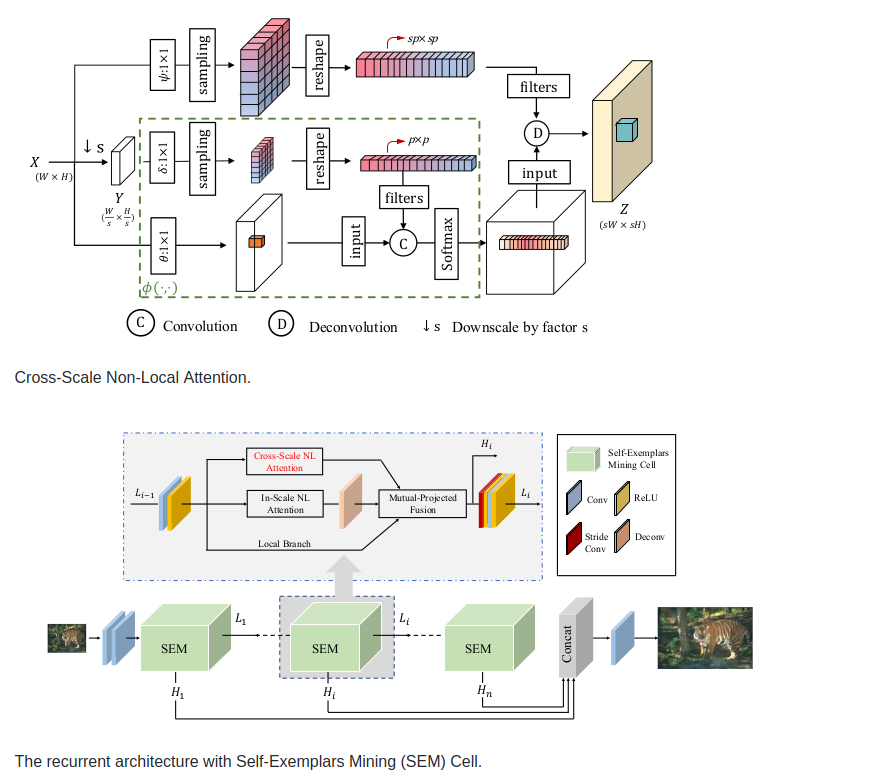
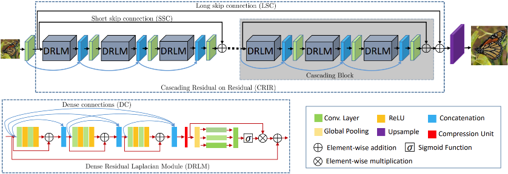
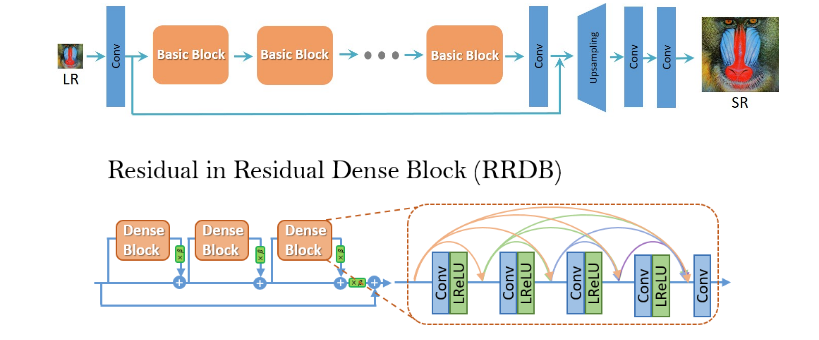

# SRWebService
 
 <h2> 1.How to use: </h2>    
 
 Just run:   
 ``` sudo docker-compose build ```    
 ``` sudo docker-compose up ``` 
 
Then go to localhost:3000 and will see your SR web service.

  <h2> 2. Swagger </h2>     
  You can take a look at microservices' API by clicking a button "Go to doc API" on the site itself.

  <h2> 3. Examples of web service work: </h2>    
  1. Original   
  
  
  
  2. CSNLN(x2)         
   Architecture:          
          
   Result:    
  
  
  3. DRLN(x4)     
   Architecture:
      
   Result:     
   
  
  4. ESRGAN(x4)        
   Architecture:         
       
   Result:      
  .png)
  
